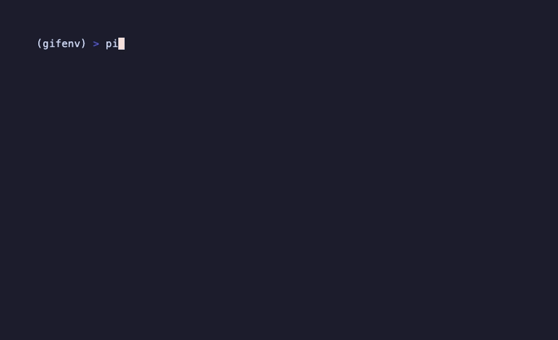
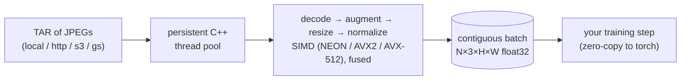
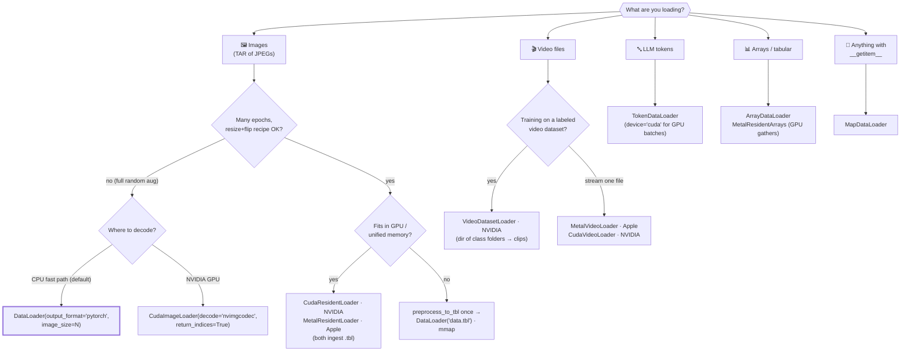
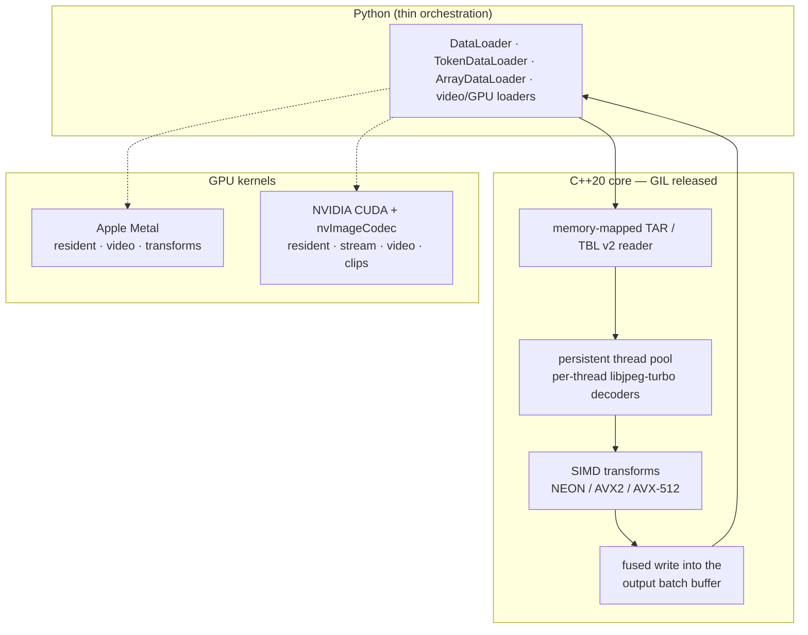

# TurboLoader

**High-performance ML data loading — a C++20 core with SIMD transforms, GPU kernels, and one `pip install`.**

[](https://pypi.org/project/turboloader/)
[](https://github.com/ALJainProjects/TurboLoader/actions/workflows/test.yml)
[](https://www.python.org/downloads/)
[](https://en.wikipedia.org/wiki/C%2B%2B20)
[](https://opensource.org/licenses/MIT)



*Real recording ([tape](docs/assets/demo.tape), [script](examples/quickstart_demo.py)): 9,469 real ImageNet
JPEGs decoded → RandomResizedCrop+flip → resized → normalized, ~60k img/s per epoch on an M4 Max laptop.*

---

## How it works

The fast path does everything in one fused, GIL-released C++ pass — no worker
processes, no per-sample Python, no offline format conversion:



- **Fast on CPU**: ~55k img/s on-the-fly (2.0× `tf.data`, 2.7× PyTorch DataLoader); trains a real ResNet-18 **1.05–1.17× faster end-to-end** (run-dependent), ~9% above the pure-GPU floor
- **Fast on GPU**: beats **NVIDIA DALI** on-the-fly (+12%, RTX 3090) and **FFCV** on pre-processed data (1.6–3.5×); ~757k img/s resident on Apple unified memory
- **Pre-processed pipeline (TBL-RAW)**: decode once, mmap-serve every epoch — **531k img/s raw serve on CPU**, beats the float32 RAM cache at every consumption level on ~1/9th the peak RSS, bit-identical batches, any hardware; **fastest e2e input pipeline we've measured** (3.64s epochs vs 3.76 TAR / 3.92 PyTorch, floor 3.39)
- **Video**: hardware decode to training batches — **3.9× the best industry standard** on Apple Silicon; CUDA `VideoDatasetLoader` trains a real video classifier **1.16× faster** than the PyTorch+PyAV recipe (first e2e video benchmark)
- **Train-ready**: fused `train_aug` (torchvision-parity RandomResizedCrop+flip), `state_dict()` mid-epoch resume, pinned-memory rings, DDP sharding
- **Also tokens & arrays**: memory-mapped `TokenDataLoader` (**1.9× nanoGPT `get_batch` to-device**, zero-alloc pinned ring, `device='cuda'` overlapped H2D), `ArrayDataLoader`, and `MapDataLoader` for any `__getitem__` dataset
- **Every number is honest**: interleaved medians, real consumption, corrections published — [full methodology](docs/benchmarks/index.md)

---

## Which loader do I use?



<details>
<summary><b>Full decision table + lifetime rules</b></summary>

| You have | Use | Notes |
|---|---|---|
| A TAR of JPEGs, training on any hardware | **`DataLoader(..., output_format='pytorch', image_size=N)`** | The default fast path — auto-fused C++ decode+resize+normalize. Start here. |
| The same, need per-sample dicts (inspection, irregular data) | `DataLoader(...)` (default `output_format='dict'`) | Several times slower; not for training loops. |
| Labels | derive from `meta['indices']` / `sample['filename']` | Samples carry **no** `label` key; align an external label array by index. |
| A dataset that fits in GPU/unified memory, many epochs | `CudaResidentLoader` (NVIDIA) / `MetalResidentLoader` (Apple) | Decode once, ~280k / 433–757k img/s per epoch. `return_indices=True` for labels. Both ingest `.tbl`. |
| Many epochs, fixed resize(+hflip) recipe, any hardware | `preprocess_to_tbl` once → `DataLoader('data.tbl')` | mmap serve, zero decode, ~zero owned RAM; bit-identical to the TAR pipeline. No random crop — bake it or use the TAR path. |
| A pre-processed dataset larger than VRAM (NVIDIA) | `CudaStreamLoader` | Fully-C++ streaming, ~140k img/s. |
| On-the-fly GPU decode (NVIDIA) | `CudaImageLoader(decode='nvimgcodec', return_indices=True)` | Beats DALI; batches complete OUT of order — align labels via the returned indices. |
| On-the-fly GPU transforms (Apple) | `MetalImageLoader` (alias of `GpuImageLoader`) | Metal decode+transforms. |
| Video files (stream one) | `MetalVideoLoader` (Apple) / `CudaVideoLoader` (NVIDIA) | Hardware decode → training batches; `iter_clips()` for augmented clips. |
| Labeled video dataset, training (NVIDIA) | `VideoDatasetLoader(root_dir)` | `root/class_x/*.mp4` → `(clips, labels, meta)` CUDA batches; threaded decode + ONE fused kernel per clip. |
| LLM token streams (memmap) | `TokenDataLoader` | CPU memmap is already optimal (measured); `device='cuda'` yields ready GPU batches (pinned ring, overlapped H2D). |
| Arrays / embeddings / tabular | `ArrayDataLoader`; `MetalResidentArrays` for GPU row gathers | |
| WebDataset-style TARs | `WebDatasetLoader` | |

Two lifetime rules: (1) loaders yielding **zero-copy views** (`pin_memory=True` ring,
Metal/CUDA resident + video loaders) reuse their buffers — consume or copy a batch
before advancing past the documented window; (2) GPU loaders yield
`__cuda_array_interface__` objects — adopt with `torch.as_tensor(x, device='cuda')`.

</details>

---

## Installation

```bash
pip install turboloader            # Linux x86_64/aarch64 + macOS arm64 wheels (CPU + Apple Metal)
```

CUDA loaders: prebuilt cu13 wheel on the [latest release](https://github.com/ALJainProjects/TurboLoader/releases/latest),
or build from source — see [GPU acceleration](docs/GPU_ACCELERATION.md).
Details: [installation guide](docs/installation.md).

---

## Quick Start

```python
import turboloader

loader = turboloader.DataLoader(
    'imagenet.tar',                 # TAR archive of JPEGs
    batch_size=128,
    image_size=224,                 # fixed size => one contiguous tensor per batch
    output_format='pytorch',        # (N, 3, H, W) float32, normalized
    transform=turboloader.ImageNetNormalize(),
    shuffle=True,
    train_aug=True,                 # fused RandomResizedCrop + flip in C++
)
for images, meta in loader:
    # images: numpy (N,3,224,224); torch.from_numpy(images) is zero-copy.
    # meta['indices'] aligns external labels to this batch.
    ...
```

> **Labels**: samples carry no `label` key (a TAR is flat). Use
> `PyTorchCompatibleLoader` for ImageFolder-style `(image, label)` tuples, or align
> a label array via `meta['indices']`.

More: [quickstart](docs/quickstart.md) · [per-sample dict API & transforms](docs/getting-started.md) ·
[tokens, arrays & any Python dataset](docs/tokens_arrays.md) ·
[interactive notebook](examples/quickstart.ipynb)

---

## Benchmarks (headlines)

Real data, real consumption, interleaved medians, warmup excluded. **Run them
yourself** — scripts in [`benchmarks/`](benchmarks/), full methodology + honest
caveats (and the corrections we published) in [docs/benchmarks](docs/benchmarks/index.md).

| Regime | TurboLoader | Best alternative | Hardware |
|---|---:|---|---|
| On-the-fly CPU (decode every epoch) | **~55k img/s** | `tf.data` ~27k · PyTorch ~20k | M4 Max |
| On-the-fly GPU | **28.5k img/s** | NVIDIA DALI 25.5k (**+12%**) | RTX 3090 |
| Pre-processed, fits in VRAM | **~280k img/s** | FFCV ~80k (**3.5×**) | RTX 3090 |
| Pre-processed, streaming > VRAM | **~140k img/s** | FFCV ~85k (**1.6×**) | RTX 3090 |
| Pre-processed, unified memory | **433–757k img/s** | numpy resident ~3.7k | M4 Max |
| Pre-processed, CPU mmap (TBL-RAW, any hardware) | **531k img/s** raw serve (99k np.sum-consumed w/ prefetch) | float32 RAM cache 62k (60k) at ~9× the peak RSS | M4 Max |
| Video → training batches | **2,556 f/s (3.9×)** | OpenCV 657 · PyAV 535 · torchcodec 173 | M4 Max |
| End-to-end ResNet-18 training | **1.05–1.17×** vs PyTorch recipe | ~9% above the pure-GPU floor | RTX 3090 |
| End-to-end VIDEO training (r3d_18) | **1.16×** vs PyTorch+PyAV recipe | both decode-bound (honest) | RTX 3090 |
| LLM tokens → device | **168M tok/s (1.9×)** | nanoGPT `get_batch` 88M | RTX 3090 |

Honest notes worth knowing before you quote these: FFCV is faster than us
*on-the-fly is impossible for it* (needs `.beton` conversion); decord beats our CUDA
video cpu-backend on weak-CPU hosts; `MetalTokenGather` ties the CPU path (so we
recommend the CPU path); e2e ResNet-18 on Apple MPS is a **tie** because the GPU is
the bottleneck; `CudaPrefetcher` measured **neutral** in our e2e runs (decode, not
H2D, binds them). All in the [full write-ups](docs/benchmarks/index.md).

---

## Architecture



Deep dive: [architecture](docs/architecture.md) · [GPU acceleration](docs/GPU_ACCELERATION.md) ·
[transform library (24 transforms)](docs/transforms.md) · [TBL v2 binary format](docs/tbl_v2_format.md)

---

## Documentation

| | |
|---|---|
| Getting started | [installation](docs/installation.md) · [quickstart](docs/quickstart.md) · [notebook](examples/quickstart.ipynb) · [troubleshooting](docs/TROUBLESHOOTING.md) |
| API | [API reference](docs/api) · [transforms](docs/api/transforms.md) |
| Guides | [PyTorch](docs/guides/pytorch-integration.md) · [TensorFlow](docs/guides/tensorflow-integration.md) · [distributed (DDP)](docs/distributed.md) |
| Examples | [ResNet-50 training](examples/imagenet_resnet50.py) · [Lightning](examples/pytorch_lightning_example.py) · [DDP](examples/distributed_ddp.py) · [GPT on tokens](examples/train_gpt_tokenloader.py) |
| Benchmarks | [methodology + full results](docs/benchmarks/index.md) · [video](benchmarks/VIDEO_RESULTS.md) · [Metal resident](benchmarks/METAL_RESIDENT_RESULTS.md) · [e2e training](benchmarks/E2E_TRAINING_RESULTS.md) |

---

## License & Citation

MIT. If you use TurboLoader in your research:

```bibtex
@software{turboloader,
  author = {Jain, Arnav},
  title = {TurboLoader: High-Performance ML Data Loading},
  year = {2026},
  url = {https://github.com/ALJainProjects/TurboLoader}
}
```

**Support**: [issues](https://github.com/ALJainProjects/TurboLoader/issues) ·
[discussions](https://github.com/ALJainProjects/TurboLoader/discussions) ·
[PyPI](https://pypi.org/project/turboloader/) · `python scripts/verify_installation.py`
